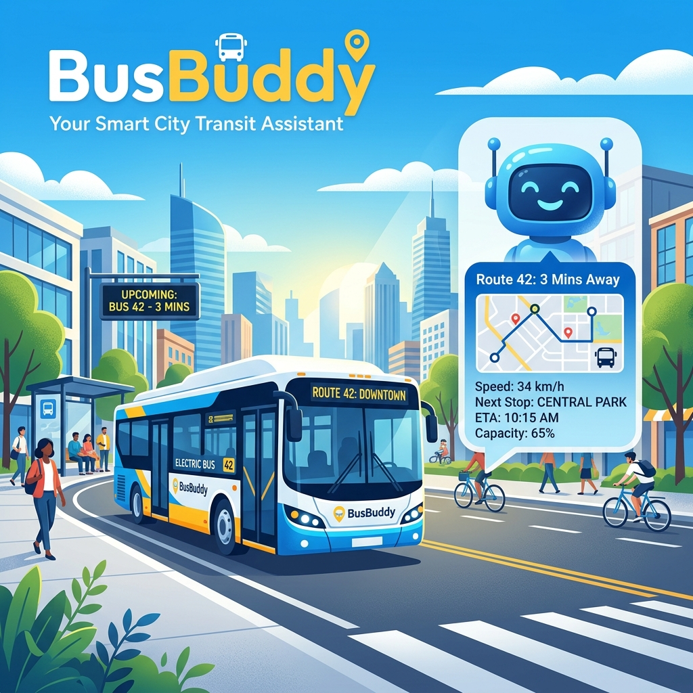

# 🚍 BUSBUDDY | Smart Transit Chatbot Assistant

BusBuddy is an AI-powered and NLP-driven smart bus assistant application designed for the Surat city bus transit system. It helps passengers find bus fares, verify route availability, and retrieve direct bus numbers between any stopping stations instantly.

### 🌐 Live Deployments & Source
*   🐙 **[GitHub Repository](https://github.com/naziashakil27/busbuddy)**
*   🚀 **[Live Website Link](https://busbuddy.onrender.com/)** *(Render)*

---

## 📸 Banner Illustration



---

## 🌟 Key Features

*   **Linear Regression Fare Prediction:** Integrates a Scikit-Learn regression model (`fare_prediction_model.pkl`) to predict adult and child fares dynamically.
*   **Deep Learning Intent Classifier:** Uses a lemmatized bag-of-words Neural Network model trained via Keras (`chatbot_model.keras`) to categorize passenger queries (checking fares, routes, greetings).
*   **Fuzzy Stop Matching:** Leverages the Levenshtein distance matching algorithm (via `fuzzywuzzy`) to handle spelling errors in stopping names (e.g., matching "adajen" to "Adajan").
*   **In-Memory Database Optimization:** Read datasets on startup and executes queries in memory to avoid repetitive, heavy disk reads.
*   **Premium Interactive Interface:** A redesigned glassmorphism dark-theme layout featuring smooth CSS bubble entrance animations and dot-wave typing indicators.

---

## 🛠️ Technology Stack

*   **Backend:** Python + Flask
*   **NLP & Machine Learning:** NLTK, TensorFlow Keras, Scikit-Learn, Pandas, NumPy, FuzzyWuzzy
*   **Frontend:** HTML5, CSS3 (Custom Grid Layouts & Animations), JavaScript (Fetch API)
*   **Hosting Configuration:** Gunicorn (production server) + Render configuration (`render.yaml`)

---

## 💻 Running Locally

### Prerequisites
Make sure you have **Python 3.10+** installed on your system.

1.  **Clone the Repository:**
    ```bash
    git clone https://github.com/naziashakil27/busbuddy.git
    cd busbuddy
    ```

2.  **Set Up a Virtual Environment:**
    ```bash
    python -m venv venv
    # Activate on Windows:
    .\venv\Scripts\activate
    # Activate on macOS/Linux:
    source venv/bin/activate
    ```

3.  **Install Dependencies:**
    ```bash
    pip install -r requirements.txt
    ```

4.  **Train the Chatbot (Optional):**
    If you modify the intents list in `intents.json`, you can retrain the neural network model:
    ```bash
    python train_chatbot.py
    ```

5.  **Run the Flask App:**
    ```bash
    python chatbot.py
    ```
    Open your browser and navigate to `http://localhost:5000/`.